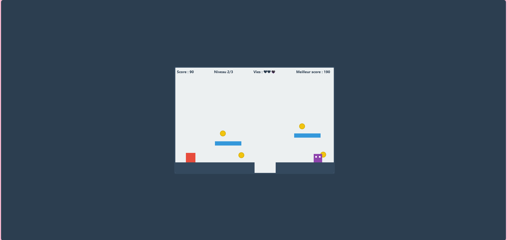

# 🎮 Cube Quest

Cube Quest est un petit jeu de plateforme Web développé en HTML, CSS et JavaScript avec l'API Canvas.

Le joueur doit parcourir plusieurs niveaux, ramasser des pièces, éviter ou vaincre les ennemis et atteindre le drapeau pour terminer chaque niveau.

## Fonctionnalités

- 3 niveaux
- Déplacement et saut du personnage
- Système de collisions et de gravité
- Ennemis
- Collecte de pièces
- Score et meilleur score
- Système de vies
- Menu, pause, victoire et game over
- Contrôles au clavier et tactiles
- Effets sonores avec Web Audio API
- Sauvegarde du meilleur score avec localStorage

## Technologies utilisées

- HTML5
- CSS3
- JavaScript
- Canvas API
- Web Audio API
- localStorage

## Contrôles

- **← / →** ou **A / D** : déplacement
- **Espace**, **↑** ou **W** : saut
- **Échap** ou **P** : pause

## Aperçu

## Auteur

Vanessa Noël-Marchand